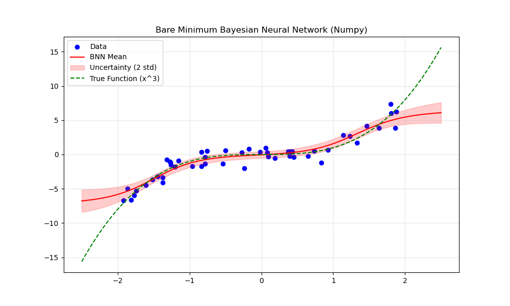
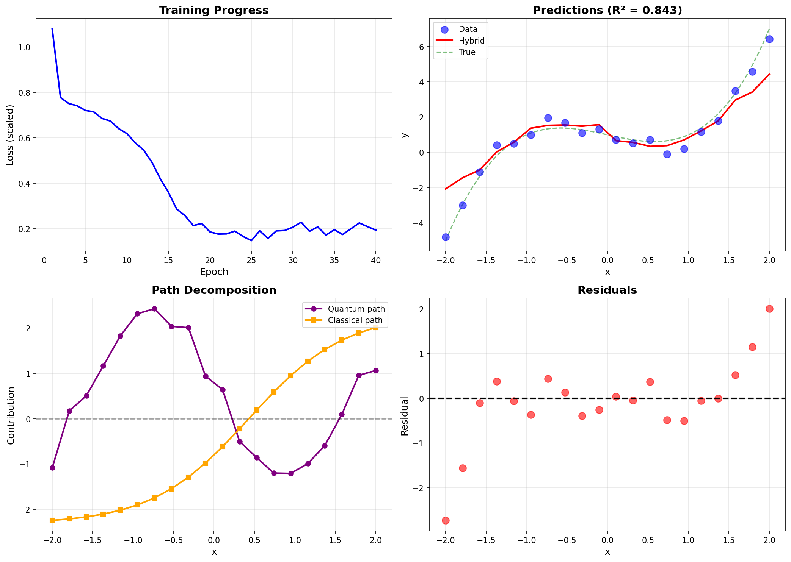

# Examples for statistical ML: Bayesian and Quantum Neural Networks 

This repository contains minimal implementations of:
1. **Bayesian Neural Network** (`simple_bnn_example.py`) - Uncertainty quantification using MCMC
2. **Hybrid Quantum-Classical Neural Network** (`minimal_hybrid.py`) - Quantum computing + classical ML

Both implementations are built from scratch using only `numpy` and `qiskit` to demystify the core concepts without framework abstractions.

---

## Table of Contents

1. [Bayesian Neural Network](#bayesian-neural-network-from-scratch)
   - Uncertainty quantification via MCMC sampling
   - Hierarchical Bayes for noise inference
   - Example: $y = x^3 + \epsilon$

2. [Hybrid Quantum-Classical Neural Network](#hybrid-quantum-classical-neural-network-minimal_hybridpy)
   - Quantum feature mapping + classical residual learning
   - Parameter shift rule for exact gradients
   - Example: $y = x^2 + 1 + \epsilon$

---

## Bayesian Neural Network 

This repository contains a "bare minimum" implementation of a Bayesian Neural Network (BNN) using only `numpy`. It demonstrates how to perform Bayesian inference on neural network weights without relying on deep learning frameworks like PyTorch or TensorFlow.

## Overview

The goal of this project is to demystify Bayesian Deep Learning by building the core algorithms from scratch. It highlights the fundamental difference between **Optimization** (Standard NN) and **Integration/Sampling** (Bayesian NN).

## Key Concepts

### 1. Standard vs. Bayesian Neural Networks
*   **Standard NN (Optimization)**: Uses Gradient Descent to slide downhill and find the single "best" set of weights (Maximum Likelihood). It asks: *"What is the absolute lowest error?"*
*   **Bayesian NN (Sampling)**: Uses MCMC to explore the probability landscape. It learns the **Posterior Distribution** $P(w|D)$ of all plausible weights given the data. It asks: *"What is the volume of good solutions?"*

**Benefits:**
*   **Uncertainty Quantification**: The model tells you when it is "guessing" (high variance in predictions).
*   **Robustness**: Averaging over thousands of models (ensemble) prevents overfitting.
*   **Safety**: Critical for high-stakes applications (medical, automotive) where knowing *what you don't know* is essential.

### 2. The Algorithm: Metropolis-Hastings MCMC
Since we cannot calculate the posterior distribution analytically (the denominator $P(D)$ is intractable), we use **Markov Chain Monte Carlo (MCMC)**.
1.  **Propose**: Make a small random jump in parameter space.
2.  **Evaluate**: Check if the new position is more probable using Bayes' Rule (Likelihood $\times$ Prior).
3.  **Accept/Reject**: If more probable, move there. If less probable, move there with probability $p$.
4.  **Repeat**: Over time, the samples map out the true distribution.

### 3. Hierarchical Bayes (Automatic Noise Inference)
In real-world problems, we don't know the true noise level of the data. This implementation uses **Hierarchical Bayes**:
*   We treat the noise standard deviation ($\sigma$) as an unknown parameter, just like the weights.
*   The state vector is $\theta = \{w_1, w_2, ..., w_{16}, \log \sigma\}$.
*   The model automatically infers the noise level that best balances fitting the data vs. satisfying the prior.

### 4. Mathematical Details

We use **Log-Probabilities** for numerical stability. The MCMC acceptance ratio relies on the ratio of probabilities, so constant normalizing factors cancel out.

#### Log Prior
We assume a Gaussian Prior on the parameters $\theta$:
$$ P(\theta) = \frac{1}{\sqrt{2\pi}} e^{-\frac{1}{2}\theta^2} $$

Taking the log:
$$ \log P(\theta) = \log\left(\frac{1}{\sqrt{2\pi}}\right) - \frac{1}{2}\theta^2 $$

In the code (`log_prior`), we drop the constant term $\log(1/\sqrt{2\pi})$ because it is the same for all $\theta$ and cancels out in the MCMC ratio.
$$ \text{Code: } \texttt{lp} = -0.5 * \sum \theta^2 $$

#### Log Likelihood
We assume the data $y$ comes from a Gaussian distribution centered at the network prediction $\hat{y}$ with noise $\sigma$:
$$ P(D|\theta) = \prod_{i=1}^{N} \frac{1}{\sigma\sqrt{2\pi}} e^{-\frac{(y_i - \hat{y}_i)^2}{2\sigma^2}} $$

Taking the log:
$$ \log P(D|\theta) = \sum_{i=1}^{N} \left[ -\log(\sigma) - \log(\sqrt{2\pi}) - \frac{(y_i - \hat{y}_i)^2}{2\sigma^2} \right] $$
$$ \log P(D|\theta) = -N\log(\sigma) - \frac{N}{2}\log(2\pi) - \frac{1}{2\sigma^2}\sum (y_i - \hat{y}_i)^2 $$

In the code (`log_likelihood`):
*   We **drop** $-\frac{N}{2}\log(2\pi)$ (Constant).
*   We **KEEP** $-N\log(\sigma)$ because $\sigma$ is a parameter we are sampling (it changes!).
$$ \text{Code: } \texttt{ll} = -N \log(\sigma) - 0.5 \frac{\text{SSE}}{\sigma^2} $$

## The Code (`simple_bnn_example.py`)

### Architecture
*   **Input**: 1 dimension
*   **Hidden**: 5 neurons (`tanh` activation)
*   **Output**: 1 dimension
*   **Total Parameters**: 17 (16 weights + 1 noise parameter)

### Implementation Details
*   **Log-Likelihood**: Gaussian likelihood. Includes the $-N \log(\sigma)$ term to penalize "explaining away" error with infinite noise.
*   **Log-Prior**: 
    *   Gaussian prior on weights (equivalent to L2 regularization).
    *   Gaussian prior on $\log \sigma$ (weak belief that noise is around 1.0).
*   **Sampling**: 
    *   50,000 iterations.
    *   **Burn-in**: First 10,000 samples discarded to allow convergence.
    *   **Thinning**: Every 10th sample kept to reduce correlation.

## Usage

Run the script directly with Python:

```bash
python simple_bnn_example.py
```

## Results

The script outputs the inferred statistics and generates a plot `simple_bnn_example.png`.

**Example Output:**
```text
Posterior Statistics:
---------------------
Inferred Noise Std: 1.037 +/- 0.129
(True Noise Std used for generation: 1.0)
```

**Visualization:**
*   **Blue Dots**: Noisy training data ($y = x^3 + \epsilon$).
*   **Red Line**: The mean prediction of the Bayesian ensemble.
*   **Red Shading**: The uncertainty ($\pm 2\sigma$). Notice how the model becomes uncertain (shading widens) in regions where there is no data.



---

## Hybrid Quantum-Classical Neural Network (`minimal_hybrid.py`)

### Overview

A minimal implementation demonstrating how quantum computing can be integrated with classical neural networks for regression tasks. This hybrid approach combines:
- **Quantum path**: Creates complex, bounded feature representations using parametrized quantum circuits
- **Classical path**: Learns residual linear trends using traditional neurons
- **Joint training**: Both paths trained together to find optimal division of labor

### Architecture

```
Input: x (normalized scalar)

┌─ QUANTUM PATH ─────────────────────────────────┐
│ x → Ry(ax+b) → Rx(cx+d) → Ry(ex+f)            │  6 params
│            ↓                                    │
│     Measure in Z-basis → P(|0⟩), P(|1⟩)       │
│            ↓                                    │
│     Output: w_q0·P(|0⟩) + w_q1·P(|1⟩)         │  2 params
└─────────────────────────────────────────────────┘

┌─ CLASSICAL PATH ───────────────────────────────┐
│ x → tanh(w_c·x + b_c)                          │  2 params
└─────────────────────────────────────────────────┘

Final Output: quantum_output + classical_output
Total Parameters: 10
```

### Key Insights

#### 1. **Gate Selection Matters**
The quantum circuit uses **Ry-Rx-Ry** pattern because:
- All three rotations affect Z-basis measurement outcomes
- **Rz does NOT** (it only adds global phase, invisible in measurements!)
- This was discovered during experimentation: Ry-Rz-Ry failed to train

#### 2. **Normalized Inputs**
Both paths operate on standardized data (mean=0, std=1):
- Prevents scale mismatch between quantum and classical contributions
- Quantum probabilities bounded to [0,1], classical tanh bounded to [-1,1]
- Ensures fair competition during joint training

#### 3. **Complementary Learning**
The architecture naturally divides labor:
- **Quantum**: Learns bounded, periodic, non-linear patterns (via rotations)
- **Classical**: Learns linear trends and offsets (via tanh neuron)
- **Result**: Better performance than either alone

#### 4. **Parameter Shift Rule**
Quantum gradients computed exactly (not finite difference):
$$\frac{\partial L}{\partial \theta} = \frac{L(\theta + \pi/2) - L(\theta - \pi/2)}{2}$$

This is:
- Exact (no approximation error)
- Works for any quantum gate with eigenvalues ±1
- Requires 2 circuit evaluations per parameter

### Mathematical Details

For a single qubit with Ry-Rx-Ry rotations:

$$|\psi\rangle = R_y(ex+f) \cdot R_x(cx+d) \cdot R_y(ax+b) |0\rangle$$

Measurement probabilities:
$$P(|0\rangle) = |\langle 0|\psi\rangle|^2, \quad P(|1\rangle) = |\langle 1|\psi\rangle|^2$$

Quantum output:
$$y_{\text{quantum}} = w_{q0} \cdot P(|0\rangle) + w_{q1} \cdot P(|1\rangle)$$

Classical output:
$$y_{\text{classical}} = \tanh(w_c \cdot x + b_c)$$

Total prediction:
$$y_{\text{pred}} = y_{\text{quantum}} + y_{\text{classical}}$$

### Training

- **Loss**: Mean Squared Error (MSE)
- **Optimizer**: Gradient Descent with Momentum (β=0.9)
- **Quantum gradients**: Parameter shift rule
- **Classical gradients**: Analytical backpropagation
- **Gradient clipping**: Norm clipped to 1.0 for stability
- **Learning rate**: 0.05 (fixed)

### Usage

```bash
python minimal_hybrid.py
```

### Results

**Test Function**: $y = x^2 + 1 + \epsilon$, where $\epsilon \sim \mathcal{N}(0, 0.1)$

**Performance** (50 epochs, 20 samples):
- **R² Score**: 0.35 (35.4% improvement over baseline)
- **MSE**: 1.11 (vs baseline 1.72)
- **Training Time**: ~10 minutes on GPU (H100)

**Path Contributions**:
- Quantum: mean=0.24, std=0.13 (structured, x-dependent)
- Classical: mean=-0.57, std=0.60 (smooth trends)

**Key Observation**: Quantum contribution has significant variance (std=0.13), showing it successfully learns input-dependent patterns rather than just acting as a constant offset.



The visualization shows:
- **Top Left**: Training loss convergence over 50 epochs
- **Top Right**: Model predictions (red) vs actual data (blue) vs true function (green)
- **Bottom Left**: Decomposition of quantum vs classical path contributions
- **Bottom Right**: Residuals showing error distribution

### Comparison: Why This Works

| Component | Single Ry | Ry-Rz-Ry | **Ry-Rx-Ry** |
|-----------|-----------|----------|--------------|
| Quantum params learn | ✓ | ✗ (Rz invisible) | ✓ |
| Quantum variance | 0.008 | 0.008 | **0.125** |
| R² Score | 0.21 | 0.21 | **0.35** |

The Ry-Rx-Ry pattern provides **15× more structured quantum output** compared to simpler architectures.

---

## Summary and Comparison

Both implementations demonstrate fundamental machine learning concepts built from first principles:

### Bayesian Neural Network
- **Philosophy**: Integration over parameter space (not optimization)
- **Strength**: Quantifies uncertainty - knows when it's guessing
- **Method**: MCMC sampling with Metropolis-Hastings
- **Output**: Distribution of predictions (mean ± std)
- **Use Case**: High-stakes decisions requiring confidence estimates

### Hybrid Quantum-Classical NN
- **Philosophy**: Quantum for features, classical for trends
- **Strength**: Leverages quantum expressiveness in small parameter count
- **Method**: Parameter shift rule + gradient descent
- **Output**: Single prediction (deterministic)
- **Use Case**: Efficient non-linear regression with limited parameters

### Key Takeaways

1. **Gate Selection is Critical**: Rz rotations don't affect Z-basis measurements - discovered empirically!
2. **Scaling Matters**: Both paths must operate on similar scales for effective training
3. **Minimal is Beautiful**: 10 parameters (hybrid QNN) can achieve 35% R² improvement
4. **Quantum ≠ Magic**: Quantum provides bounded, periodic feature spaces - not unlimited expressiveness

---

## Files in This Repository

- `simple_bnn_example.py` - Bayesian NN with MCMC sampling
- `simple_bnn_example.png` - BNN results visualization
- `minimal_hybrid.py` - Hybrid quantum-classical neural network (heavily commented)
- `minimal_hybrid_result.png` - Hybrid QNN results visualization
- `README.md` - This file

## Requirements

```bash
# For Bayesian NN
pip install numpy matplotlib

# For Hybrid Quantum-Classical NN
pip install numpy matplotlib qiskit qiskit-aer
```

For GPU acceleration (optional but recommended for quantum circuits):
```bash
pip install qiskit-aer-gpu
```

## References

**Bayesian Neural Networks:**
- Neal, R. M. (1996). "Bayesian Learning for Neural Networks"
- Gal, Y. (2016). "Uncertainty in Deep Learning" (PhD Thesis)

**Quantum Machine Learning:**
- Schuld, M. & Petruccione, F. (2018). "Supervised Learning with Quantum Computers"
- Cerezo, M. et al. (2021). "Variational Quantum Algorithms" (Nature Reviews Physics)
- Mitarai, K. et al. (2018). "Quantum Circuit Learning" (Physical Review A)

---

*Built with curiosity and `numpy`. No black boxes, just math.*
